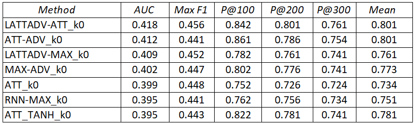
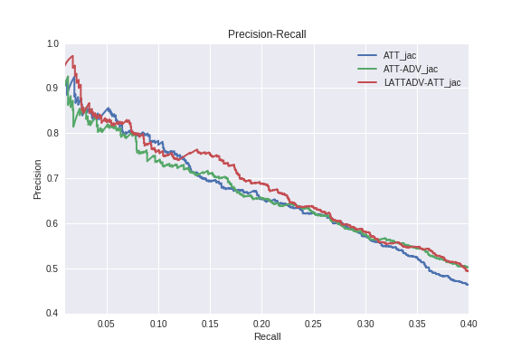

# _LATTADV_: [Relation Extraction](https://en.wikipedia.org/wiki/Relationship_extraction) With Leveled Adversarial Neural Networks and MDL Database Expansion.

_Contributed by [Diyah Puspitaningrum](http://diyahpuspitaningrum.net/)_


These recent years, state-of-the-art relation extraction involves deep learning method to classify ontology of a document's relation. In this project we demonstrate the use of _MDL_ database expansion as a preprocessing step to improve classification performance on relation extraction task. For a classifier, since a relation is viewed as a semantic composition of sentence embedding, the false labelling problem can be addressed via attention network or leveled adversarial training. The selective attention aims to dynamically reduce weights of noisy instances while adversarial training aims to improve robustness of a classifier through regularization of loss function's gradient direction given small perturbations to the classifier system. Our proposed model, _LATTADV_ is evaluated on a popular benchmark dataset in relation extraction, i.e. New York Times dataset, the same as used by [Riedel et. al. (2010)](https://www.researchgate.net/publication/220698997_Modeling_Relations_and_Their_Mentions_without_Labeled_Text), the _LATTADV_ model has shown significant improvement as compared with other PCNN based methods on relation extraction. We have shown that the MDL data expansion and the leveled adversarial strategy both can be two supporting strategies to improve the PCNN performance.

We inspired from the paper "_Adversarial Training for Relation Extraction_" [Wu et al., (2017)](http://www.aclweb.org/anthology/D17-1187) and the paper "_Neural Relation Extraction with Selective Attention over Instances_" [Lin et al., (2016)](http://www.aclweb.org/anthology/P16-1200) and a good understanding about _MDL_ principle from the dissertation "_Patterns, Models, and Queries_" [Diyah Puspitaningrum, (2012)](http://diyahpuspitaningrum.net/puspitaningrum2012_dissertation.pdf). Our contribution are three-fold: (i). Database expansion with the use of semantic understanding of entity identification is a new approach in relation extraction preprocessing technique. (ii). The leveled classifier with adversarial training, _LATTADV_, is an independent classifier which means that the model can also be applied on any classification tasks. (iii). Tested on state-of-the-art methods (PCNN ATT [Lin et al., (2016)](http://www.aclweb.org/anthology/P16-1200), PCNN ADV, PCNN MAX-ADV [Wu et al., (2017)](http://www.aclweb.org/anthology/D17-1187)), the proposed _LATTADV_ on _MDL_ data expansion can be significantly improve the deep learning (PCNN) performance.

# Evaluation Results:

### Performances comparison between _LATTADV-ATT_ and other baselines:



 
Precision/Recall curve of our method (_LATTADV_) with database expansion compared to state-of-the-art methods:




# Data
We use the same dataset(NYT10, New York Times Annotated Corpus ([LDC Data LDC2008T19](https://catalog.ldc.upenn.edu/LDC2008T19)) as in [Lin et al.,2016](https://github.com/thunlp/OpenNRE/tree/old_version)) and Riedel et. al. ([2010](https://github.com/diyahpus/RiedelNYT0506)) and we expand it. We provide the dataset in origin_data/ directory.

To run our code, the dataset should be put in the folder origin_data/ using the following format, containing four files: train.txt (the training file), test.txt (testing file), relation2id.txt (all relations and corresponding ids), and vec.txt (the pre-train word embedding file).

# Codes
The source codes are in the current main directory. `network.py` contains the whole neural network's definition. We developed our model by adopting open source framework proposed by [Tianyu Gao, Xu Han, Lumin Tang, Yankai Lin, Zhiyuan Liu](https://github.com/thunlp/OpenNRE/tree/old_version).

# Requirements
Python (>=2.7), TensorFlow (>=1.4.1), GPU CUDA(>=8.0), scikit-learn (>=0.18), Matplotlib (>=2.0.0)


## Quick Start

### Preprocessing data
```
wget "https://github.com/thunlp/OpenNRE/archive/old_version.zip"
unzip old_version.zip
```
The processed data will be stored in `./OpenNRE-old_version`

```
git clone https://github.com/diyahpus/Relation_Extraction_with_MDL.git
```
The processed data will be stored in `./Relation_Extraction_with_MDL`

```
cp "/content/drive/My Drive/LATTADV-ATT properties/Framework.py"  "/content/OpenNRE_old/OpenNRE/framework.py"
cp "/content/drive/My Drive/LATTADV-ATT properties/train_LATTADV-ATT.py"  "/content/OpenNRE_old/OpenNRE/train.py"
cp "/content/drive/My Drive/LATTADV-ATT properties/test_LATTADV-ATT.py"  "/content/OpenNRE_old/OpenNRE/test.py"
cp "/content/drive/My Drive/LATTADV-ATT properties/LATTADV-ATT.py"  "/content/OpenNRE_old/OpenNRE/model/LATTADV-ATT.py"
```

```
cd '/content/OpenNRE_old/OpenNRE/origin_data'
```

```
cp /content/Relation_Extraction_with_MDL/rel*.txt /content/OpenNRE_old/OpenNRE/origin_data/
cp /content/Relation_Extraction_with_MDL/jaccard_k3_20_42/*.* /content/OpenNRE_old/OpenNRE/origin_data/
cat test_segment_aa.txt test_segment_ab.txt >> test.txt
cat vec_segment_aa.txt vec_segment_ab.txt >> vec.txt
cat train_segment_aa.txt train_segment_ab.txt train_segment_ac.txt train_segment_ad.txt >> train.txt
```
The processed data will be stored in `./origin_data`


### Examples of Processing the Data
```
cd /content/OpenNRE_old/OpenNRE
```

```bash
python3 gen_data.py
```
The processed data will be stored in `./data`

### Train Model
```
python3 train.py --model_name LATTADV-ATT
```

### Test Model see available model `./model`
```bash
python3 test.py --model_name LATTADV-ATT
```

All checkpoints are stored in `./checkpoint`. Best checkpoint in `./test_result`.

### Plot
```bash
python3 draw_plot.py LATTADV-ATT
```

The plot will be saved as `./test_result/pr_curve.png`.


# Request for additional results (optional)
We provide .ipynb files as log for our experiments as well as best checkpoint for drawing charts. Contact: diyahpuspitaningrum@gmail.com .

 


## Reference

1. **Patterns, Models, and Queries.** _Diyah Puspitaningrum._ Utrecht University2012. [dissertation](http://diyahpuspitaningrum.net/puspitaningrum2012_dissertation.pdf)

2. **Neural Relation Extraction with Selective Attention over Instances.** _Yankai Lin, Shiqi Shen, Zhiyuan Liu, Huanbo Luan, Maosong Sun._ ACL2016. [paper](http://www.aclweb.org/anthology/P16-1200)

3. **Widened KRIMP: Better Performance through Diverse Parallelism.** _Oliver R. Sampson and Michael R. Berthold._ IDA2014. [paper](https://www.researchgate.net/publication/267636338_Widened_KRIMP_Better_Performance_through_Diverse_Parallelism)

4. **Adversarial Training for Relation Extraction.** _Yi Wu, David Bamman, Stuart Russell._ EMNLP2017. [paper](http://www.aclweb.org/anthology/D17-1187)

5. **Compression Picks Item Sets That Matter.** _Matthijs van Leeuwen, Jilles Vreeken, and Arno Siebes._ PKDD2006. [paper](https://link.springer.com/content/pdf/10.1007/11871637_59.pdf)

6. **A Soft-label Method for Noise-tolerant Distantly Supervised Relation Extraction.** _Tianyu Liu, Kexiang Wang, Baobao Chang, Zhifang Sui._ EMNLP2017. [paper](http://aclweb.org/anthology/D17-1189)

7. **Modeling relations and their mentions without labeled text.** _Sebastian Riedel, Limin Yao, and Andrew McCallum._ ECMLPKDD'10(III). [paper](https://www.researchgate.net/publication/220698997_Modeling_Relations_and_Their_Mentions_without_Labeled_Text)

8. **Reinforcement Learning for Relation Classification from Noisy Data.** _Jun Feng, Minlie Huang, Li Zhao, Yang Yang, Xiaoyan Zhu._ AAAI2018. [paper](https://tianjun.me/static/essay_resources/RelationExtraction/Paper/AAAI2018Denoising.pdf)

